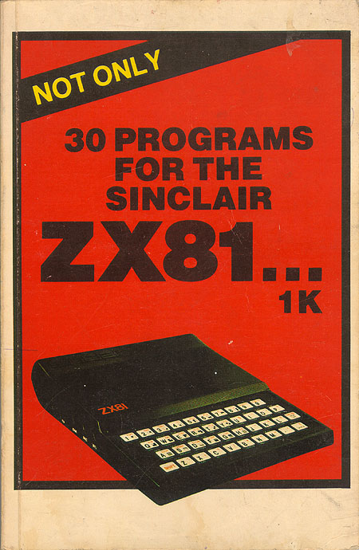

# Not Only 30 Programs for the Sinclair ZX81

Run the programs from this classic book in your browser, or load them onto a real ZX81.



## How this site was built

I transcribed the ZX81 programs from a PDF copy of [Not Only 30 Programs for the Sinclair ZX81](https://archive.org/download/30-programs-for-the-zx-81-1-kacme/30_programs_for_the_ZX81_1K%28acme%29.pdf). (There is a [text version](http://amigan.1emu.net/aw/not30.txt) available too.)

The programs are saved in text format with a `.bas` file extension. Graphics characters and inverse video characters are represented using the conventions described in [ZXText2P](http://freestuff.grok.co.uk/zxtext2p/index.html). The sequence `\::`, for example, represents a black square.

The `zxtext2p` command was used to convert these text files to ZX81 P files suitable for use in an emulator, or a real ZX81. For example:

```bash
export PATH=$PATH:~/projects-workspace/zxtext2p
zxtext2p -d -o web/images/craps.p src/craps.bas
xxd -p web/images/craps.p | tr -d '\n' > web/images/craps.p.hex
```

Note that the `-d` option is needed to collapse the display file in the P file so that it can fit on a 1K ZX81. This option is not available on the standard version of ZXText2P, so I created a version that adds it. [TODO: link]

Or just run the following to convert all files:

```bash
make
```

The web pages use the excellent [JtyOne Online ZX81 Editor](https://www.zx81stuff.org.uk/zx81/jtyone.html) to run the programs.

## Notes on the programs

### Noughts and crosses

As the book says "its logic is fairly well hidden and the use of variables in the listing makes it difficult to know what is happening".
This is as a result of getting it to work in under 1K of memory.

It turns out that it doesn't work on a ZX81 with 16K because of the way it uses the display file. The 1K ZX81 has a "collapsed" (or compressed) representation, where blank characters are skipped - so a blank screen is just a series of newlines. (This is mentioned in Chapter 27 of the ZX81 manual.) With a 16K memory extension this optimisation is not needed, and all characters on the screen can be stored, even blank ones.

If we look at the program's display routine, from line 400, we see that line 420 finds the address of the display file by `PEEK`ing the `D_FILE` system variable at address 16396 and 16397.

Line 440 then looks at all positions in the display file memory (it is looping over `I`) and if any are the number being searched for (`R`, which can be between 1 and 8) then that memory address is set (by a `POKE` command) to `O` (52) or `X` (61).

The trouble is that the loop at line 430 is only looping to `Z*B + B`, which since `Z=4` and `B=8` is only 40 characters, which suffices for the collapsed display of the 1K ZX81, but on a 16K machine it won't check enough of the display file before exiting the loop. This means that not all of the board is searched, and the game doesn't work properly.

I made an alteration to make it work when the display file is not collapsed (see `src/noughts_and_crosses_16k.bas`), but it is a lot slower since it has to scan a lot more memory.

### Pinch

The program never terminates (by quick inspection). Not sure if the logic is correct in all cases.

### Battleships

The program doesn't check if the battleships overlap, so there can be less than 8 `X` positions, so it doesn't terminate properly since the number of hits never reaches 8. However, it also doesn't check if you have already found an `X` so you can just repeat a previous position and it counts as a new hit!

### Craps

Escaping quotes in quotes needs `\"` for `zxtext2p`, rather than `""` as on the ZX81 keyboard (shift Q).

### Blackjack

This one uses two programs: the first to load variables (after which it can be deleted to free up space), and the second to do the work.

This means that `zxtext2p` isn't sufficient to produce a single P file for the final result. So to get around this I used `zxtext2p` to convert the second program to a P file, which I then loaded in an emulator (zxsp). I then defined the variables by entering them without line numbers, then saved a new P file containing the program and the variables.

However, zxsp can't save a 1K P file with a collapsed display file (I'm not aware of any emulator that can do this on a Mac). So I wrote a script to collapse the display file:

```
python scripts/collapse_dfile.py web/images/blackjack_tmp.p web/images/blackjack.p
printf '\x40' | dd of=web/images/blackjack.p bs=1 seek=50 count=1 conv=notrunc # fix CDFLAG
xxd -p web/images/blackjack.p | tr -d '\n' > web/images/blackjack.p.hex
rm web/images/blackjack_tmp.p
```

### Caves and Pitfalls

Like Blackjack, this program is entered in two parts in order to save space.

This time I used [JSZeddy](https://weggetjes.nl/jszeddy/jszeddy.html), an online ZX81 emulator, since it allows you to load multiple listings without resetting the memory, which is crucial. It allows you to export the P file as a hex string, so I converted it to a binary file as follows:

```
xxd -p -r web/images/caves_and_pitfalls.p.hex web/images/caves_and_pitfalls_tmp.p
```

Then did the 1K conversion:

```
python scripts/collapse_dfile.py web/images/caves_and_pitfalls_tmp.p web/images/caves_and_pitfalls.p
xxd -p web/images/caves_and_pitfalls.p | tr -d '\n' > web/images/caves_and_pitfalls.p.hex
rm web/images/caves_and_pitfalls_tmp.p
```

### Doctor ZX81

Parts of this program are written in machine code, and there's an elaborate procedure to enter the code that's described in the book.

I used JSZeddy again to produce a hex file, which I then processed as follows:

```
xxd -p -r web/images/doctor_zx81.p.hex web/images/doctor_zx81_tmp.p
python scripts/collapse_dfile.py web/images/doctor_zx81_tmp.p web/images/doctor_zx81.p
xxd -p web/images/doctor_zx81.p | tr -d '\n' > web/images/doctor_zx81.p.hex
rm web/images/doctor_zx81_tmp.p
```

### Draughts

This program is the most ambitious in the book; even entering the code is a challenge. Rather than type the machine code one byte at a time, as suggested in the book, I cut and pasted the code and created the REM line in a syntax that JSZeddy understands (see `src/draughts_program1.txt`).

```
xxd -p -r web/images/draughts.p.hex web/images/draughts_tmp.p
python scripts/collapse_dfile.py web/images/draughts_tmp.p web/images/draughts.p
xxd -p web/images/draughts.p | tr -d '\n' > web/images/draughts.p.hex
rm web/images/draughts_tmp.p
```

Unfortunately, this did not work! I couldn't get the program running on a real 1K machine.

## Copyright and License

The programs are copyright (c) 1981 by Beam Software.

The emulator is subject to the GPL license, version 2. See https://www.zx81stuff.org.uk/zx81/jtyone.html
